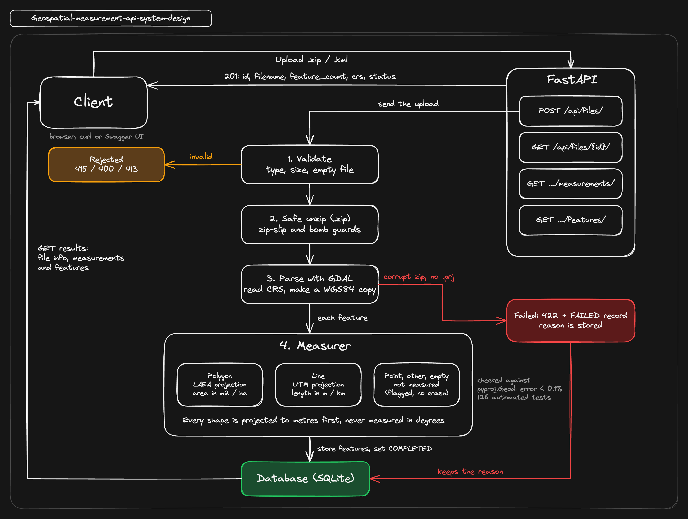
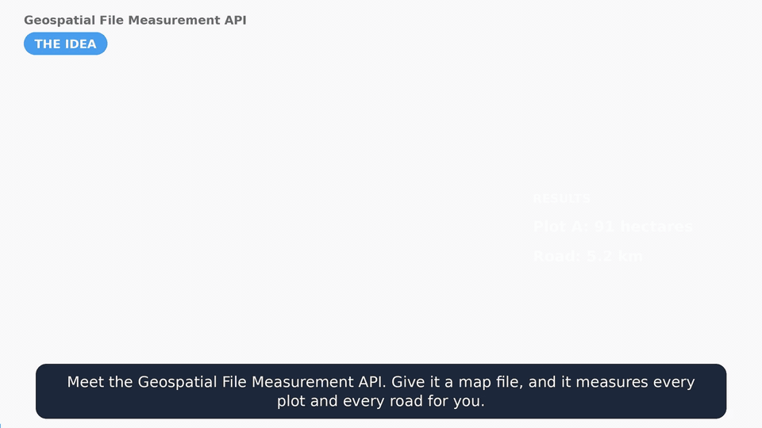

# Geospatial File Measurement API

A FastAPI service that accepts a **zipped Shapefile** or a **KML** file, extracts every feature, and returns
per-feature **area** (polygons) and **length** (lines). Measurements are never taken on latitude/longitude
degrees: each geometry is projected into a metric CRS first.



<p align="center">
  <br>
 <sub>One-minute explainer for non-technical readers: <a href="https://youtu.be/xS6odWuBMZM">Watch the video</a></sub>
</p>

## Setup

Requires Python 3.11+ (developed on 3.12). The geospatial dependencies install from binary wheels, so no system GDAL is needed.

```bash
python3 -m venv .venv
source .venv/bin/activate
pip install -r requirements-dev.txt

uvicorn app.main:app --reload     # API at http://localhost:8000, Swagger docs at /docs
pytest                            # run the tests
```

Open **http://localhost:8000/** for a small web page where you can upload a `.zip` or `.kml` and check the result.

With Docker:

```bash
docker build -t geo-api .
docker run --rm -p 8000:8000 -v geo-data:/data geo-api
```

## API

| Method | Path | Purpose |
|---|---|---|
| `POST` | `/api/files/` | Upload and process a file (multipart field `file`) |
| `GET` | `/api/files/{id}/` | File information |
| `GET` | `/api/files/{id}/measurements/` | Per-feature measurements and a whole-file summary |
| `GET` | `/api/files/{id}/features/` | Features with geometry, CRS and properties |

The examples below were produced by running the service on the files in [`samples/`](samples/).

### Upload: `POST /api/files/`

```bash
curl -X POST http://localhost:8000/api/files/ -F "file=@samples/survey.kml"
```

`201 Created`

```json
{
  "id": "8b24c7ebabd046ad9e744931684af72c",
  "filename": "survey.kml",
  "file_type": "kml",
  "size_bytes": 2507,
  "feature_count": 7,
  "crs": "EPSG:4326",
  "status": "COMPLETED",
  "error": null,
  "created_at": "2026-10-07T13:35:45.732136Z"
}
```

| Status | When |
|---|---|
| `201` | Processed, `status` is `COMPLETED` |
| `400` | Empty upload |
| `413` | Upload larger than the size limit |
| `415` | Not a `.zip` or `.kml` |
| `422` | Accepted but could not be processed (corrupt zip, no `.shp`, no `.prj`, unsafe paths...). The body is the stored record with `"status": "FAILED"` and the reason in `error`, and it can still be fetched later |

```bash
curl -X POST http://localhost:8000/api/files/ -F "file=@broken.zip"      # not a real zip
```

`422 Unprocessable Entity`

```json
{
  "id": "f2ca8743c0274a5298464884b2a8126b",
  "filename": "broken.zip",
  "file_type": "shapefile",
  "size_bytes": 10,
  "feature_count": 0,
  "crs": null,
  "status": "FAILED",
  "error": "The uploaded file is not a valid zip archive: File is not a zip file",
  "created_at": "2026-10-07T13:35:59.245493Z"
}
```

### File information: `GET /api/files/{id}/`

Returns the same object as the upload response (`404` for an unknown id). `crs` is a single CRS, `"MIXED"` if the
layers differ, or `null` if the file had no features.

### Measurements: `GET /api/files/{id}/measurements/`

Query parameters: `limit` (1-1000, default 100), `offset`, `geometry_type` (e.g. `Polygon`). `404` for an unknown id,
`409` if the file is not `COMPLETED`.

```bash
curl http://localhost:8000/api/files/8b24c7ebabd046ad9e744931684af72c/measurements/
```

`200 OK` (two of the seven results shown; the `summary` always covers the whole file)

```json
{
  "file_id": "8b24c7ebabd046ad9e744931684af72c",
  "summary": {
    "feature_count": 7,
    "total_area_sq_m": 2211348.279,
    "total_area_hectares": 221.134828,
    "total_length_m": 7248.488,
    "total_length_km": 7.248488,
    "by_status": { "MEASURED": 4, "NOT_APPLICABLE": 1, "NO_GEOMETRY": 1, "UNSUPPORTED": 1 },
    "by_geometry_type": { "None": 1, "GeometryCollection": 1, "LineString": 1, "MultiLineString": 1, "Point": 1, "Polygon": 2 }
  },
  "total": 7,
  "limit": 100,
  "offset": 0,
  "results": [
    {
      "feature_index": 0,
      "layer": "Plots",
      "geometry_type": "Polygon",
      "status": "MEASURED",
      "measurement": { "area_sq_m": 910550.181, "area_hectares": 91.055018 },
      "projected_crs": "+proj=laea +lat_0=28.6 +lon_0=77.2 +x_0=0 +y_0=0 +datum=WGS84 +units=m +no_defs",
      "message": null,
      "warnings": []
    },
    {
      "feature_index": 0,
      "layer": "Infrastructure",
      "geometry_type": "LineString",
      "status": "MEASURED",
      "measurement": { "length_m": 5161.895, "length_km": 5.161895 },
      "projected_crs": "EPSG:32643",
      "message": null,
      "warnings": []
    }
  ]
}
```

Each feature has one `status`: `MEASURED` (polygons get `area_sq_m` and `area_hectares`, lines get `length_m` and
`length_km`), `NOT_APPLICABLE` (points), `UNSUPPORTED` (e.g. GeometryCollection), `NO_GEOMETRY` (null or empty), or
`ERROR` (that one feature could not be measured; the others are unaffected). `warnings` flags invalid geometry.

### Features: `GET /api/files/{id}/features/`

Query parameters: `limit`, `offset`, `geometry_type`, `layer`. Returns each feature's geometry in its original CRS, that
CRS, and its properties.

```json
{
  "feature_index": 0,
  "layer": "Plots",
  "geometry_type": "Polygon",
  "geometry": { "type": "Polygon", "coordinates": [[[77.2, 28.6, 0.0], "..."]] },
  "crs": "EPSG:4326",
  "properties": { "Name": "Plot A (with a pond)", "owner": "Singh", "crop": "wheat" }
}
```

## Architecture

### Application structure

```
app/
  main.py            create_app() factory, exception handlers, /health
  config.py          settings (GEO_* environment variables)
  database.py        engine and session factory
  models.py          UploadedFile, Feature, enums
  schemas.py         Pydantic response models
  errors.py          domain exceptions, each with its HTTP status
  api/files.py       thin route handlers
  api/ui.py, static/ the upload web page
  services/
    archive.py       safe zip extraction
    crs.py           CRS labels and projected-CRS selection
    measurement.py   Measurer: area and length per geometry
    parsing.py       Shapefile / KML to plain feature records
    ingest.py        orchestration: upload, parse, measure, persist
    reports.py       read-side queries and summaries
samples/, tests/
```

Routes only translate HTTP into service calls. Parsing, CRS and measurement code knows nothing about FastAPI or the
database, so each part can be tested on its own.

### File-processing flow

1. **Validate.** The extension must be `.zip` or `.kml` (`415`). The upload is streamed to a temporary folder with a size
   cap; empty (`400`) and oversized (`413`) files are rejected. The client's filename is never used as a path.
2. **Record.** A `PROCESSING` row is committed first, so a later failure has something to mark `FAILED`.
3. **Unzip safely** (zip only). Paths that resolve outside the target folder are rejected, and the entry count and
   uncompressed size are capped, which stops zip-slip and zip bombs.
4. **Parse.** GDAL (through pyogrio) reads every `.shp` in the archive, or every layer of the KML (each KML folder is a
   layer). Each layer's CRS is resolved and a WGS84 copy is made for measuring. The original geometry is kept for output.
5. **Measure and store.** Each feature goes through the `Measurer`, then rows are inserted in chunks.
6. **Complete.** `COMPLETED` is set in the same transaction as the feature rows, so a client never sees a half-processed
   file. Bad input rolls everything back, stores `FAILED` with the reason, and answers `422`.

### Measurement flow

```
geometry (WGS84, forced to 2D) -> check coordinates -> by type:
  Polygon / MultiPolygon   -> project to a local equal-area CRS (LAEA)  -> area in m2 and hectares
  LineString / MultiLine   -> project to the UTM zone                   -> length in m and km
  Point / MultiPoint       -> NOT_APPLICABLE
  GeometryCollection etc.  -> UNSUPPORTED          null or empty -> NO_GEOMETRY
```

Each feature is measured inside a `try/except`, so one bad feature becomes an `ERROR` row and never fails the file.
Non-finite coordinates, or coordinates outside the valid lon/lat range, are also an `ERROR`. Invalid polygons are measured
and flagged with a warning that includes `shapely.is_valid_reason`.

### CRS handling

- **Never measure in degrees.** A degree of longitude is about 111 km at the equator and shrinks to zero at the poles.
  A 1° x 1° box at 60°N is 6,123 km², but `polygon.area` on the lon/lat coordinates gives `1.0`.
- Every geometry is brought to WGS84, then **projected per feature** around its bounding-box centre.
- **Area uses a local Lambert Azimuthal Equal-Area projection.** It preserves area wherever it is centred, so there is no
  zone boundary and no area bias.
- **Length uses the UTM zone** of the feature (UPS beyond 84°N and 80°S), which keeps distances within about 0.1%.
- Transformers use `always_xy=True` (lon, lat order) and live on one `Measurer` per upload, because they are not
  guaranteed to be thread-safe.
- The CRS used for each result is returned as `projected_crs`.

Measured against `pyproj.Geod` on the WGS84 ellipsoid (seven locations from the equator to 80°N), the worst error was
0.001% for area and 0.08% for length.

## Design decisions

| Decision | Chosen | Alternatives considered |
|---|---|---|
| Framework | **FastAPI**: typed models, automatic OpenAPI, light | Django + DRF: more than three endpoints need (admin, ORM, auth) |
| Processing | **Synchronous**, inside the upload request | Background queue (Celery/RQ): the right answer at scale, but it adds a broker and polling for little benefit here. The `status` field already models it |
| Database | **SQLite** by default, `GEO_DATABASE_URL` to change it | Postgres/PostGIS: better at scale, but needs a server to run |
| Reading files | **geopandas + pyogrio (GDAL)** for both formats | `fiona` (older, slower, same GDAL); a hand-written KML parser (fragile, and no Shapefile support) |
| Measuring | **Project, then measure**: LAEA for area, UTM for length | `pyproj.Geod` for everything (used as the test oracle instead, since the brief asks for a projected CRS); one global projection such as Web Mercator (area is wrong at every latitude) |
| Projection scope | **Per feature** | One projection per file: breaks when a file spans zones or continents |
| Storage | **Store results** when the file is uploaded | Recompute on every request: wasteful, and the file would have to be kept |
| Failures | **`FAILED` record + `422`**, and a per-feature status | A bare error loses the record; failing the whole file for one bad feature punishes the good data |
| Invalid polygons | **Measure and warn** | `buffer(0)` silently changes the shape; rejecting hides usable data |
| Missing `.prj` | **Reject** with a clear message | Assuming EPSG:4326 gives confident but wrong numbers when the data is really in metres |

## Learnings

- **Grid area is not ground area.** A 200 m x 150 m rectangle in EPSG:32643 is 30,000 m² on the UTM grid but 29,989 m² on
  the ground, so the tests compare against an ellipsoidal calculation instead of trusting a file's own coordinates.
- **Test the test oracle.** `pyproj.Geod` adds a polygon hole instead of subtracting it when the hole is wound the same
  way as the shell. My first failing accuracy test was the reference's fault, not the service's.
- **Small library details hide big bugs.** `get_coordinates(include_z=True)` returns NaN Z for 2D geometries, which made a
  validity check silently drop every point's geometry. Python's `zipfile` stores permission bits without file-type bits,
  which made a symlink check skip every ordinary file. Smoke tests with real files caught both.
- **GDAL's KML behaviour matters.** Folders become separate layers, a placemark without geometry is still a feature, and a
  mixed `MultiGeometry` becomes a GeometryCollection.
- **Axis order.** EPSG:4326 is officially latitude-first but GIS data is longitude-first; `always_xy=True` removes the doubt.
- **Reject rather than guess, and keep failures queryable.** A stored `FAILED` record is more useful than a lost error.

## Future scope

- A background queue (Celery or RQ): `POST` returns `202` and clients poll `GET /api/files/{id}/`.
- KMZ, GeoJSON and GeoPackage uploads (GDAL already reads them).
- A geodesic cross-check mode that reports `pyproj.Geod` values next to the projected ones.
- Edge densification before projecting, and splitting at the antimeridian.
- Authentication, rate limiting and per-user file ownership.
- Alembic migrations and PostGIS for spatial indexes and queries.
- Streaming ingest for very large files.
- Structured logging, request ids and metrics.
- CI with GitHub Actions (`ruff`, `pytest`, Docker build).
