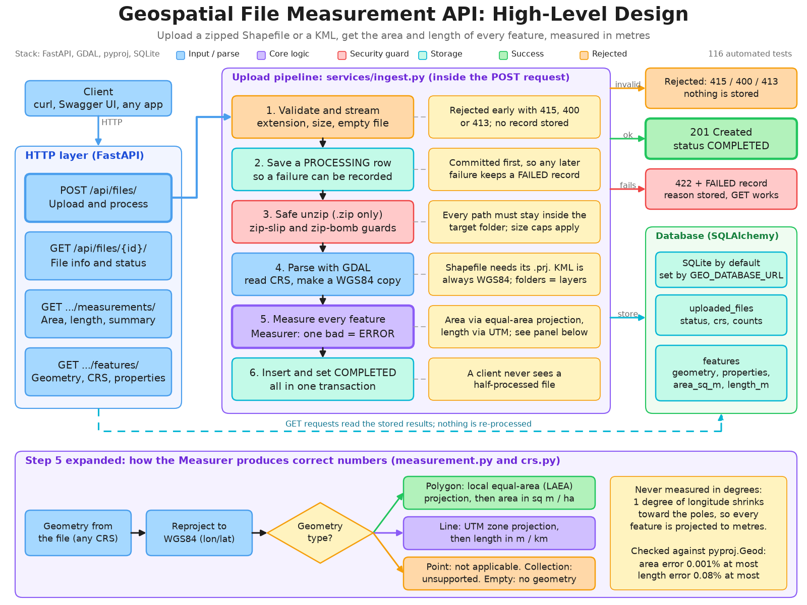

# Geospatial File Measurement API

A FastAPI service that accepts a **zipped Shapefile** or a **KML** file, extracts every feature, and returns
per-feature **area** (polygons) and **length** (lines). Measurements are never taken on latitude/longitude
degrees: each geometry is projected into a metric CRS first.

**New here?** Watch the [one-minute explainer video](docs/explainer-video.mp4) (no technical background needed), or open the built-in [test console](#test-console-web-ui) once the server is running.

## Features

- `POST /api/files/` uploads and processes a `.zip` (Shapefile) or `.kml` synchronously.
- Per feature: index, layer, geometry type, geometry (GeoJSON-style, original CRS), CRS, properties.
- Polygon / MultiPolygon -> area in m² and hectares (holes subtracted). LineString / MultiLineString -> length in m and km.
  Points are `NOT_APPLICABLE`; GeometryCollections are `UNSUPPORTED`; nothing crashes the file.
- Projection per feature: local **Lambert Azimuthal Equal-Area** for area, **UTM zone** for length.
- Defensive input handling: zip-slip, zip bombs, size and feature limits, missing `.prj`, corrupt files.
- Results are stored in a database (SQLite by default; the URL is configurable) and totals are computed with SQL aggregates.
- Paginated measurements and features endpoints, OpenAPI docs at `/docs`, `/health` endpoint.
- A built-in **test console** at `/` to upload a file, check the response against the assignment's example, and validate the measurements (see below).
- Accuracy is tested against `pyproj.Geod` ellipsoidal calculations (126 tests).

## Setup

Requires Python 3.11+ (developed and tested on 3.12). Geospatial dependencies install from binary wheels, so no
system GDAL is needed.

```bash
python3 -m venv .venv
source .venv/bin/activate
pip install -r requirements-dev.txt      # use requirements.txt for runtime only

uvicorn app.main:app --reload            # http://localhost:8000  (docs at /docs)
pytest                                   # run the test suite
ruff check . && ruff format --check .    # lint
python samples/make_samples.py           # regenerate samples/survey.kml and samples/parcels_utm43.zip
```

### Docker

```bash
docker build -t geo-api .
docker run --rm -p 8000:8000 -v geo-data:/data geo-api
```

The image stores its SQLite database in the `/data` volume.

### Configuration

All settings are environment variables with the `GEO_` prefix (a `.env` file is also read).

| Variable | Default | Meaning |
|---|---|---|
| `GEO_DATABASE_URL` | `sqlite:///./geo.db` | SQLAlchemy URL. Only SQLite was exercised; for Postgres use e.g. `postgresql+psycopg://user:pw@host/db` and install the driver yourself |
| `GEO_MAX_UPLOAD_BYTES` | `52428800` (50 MB) | Largest accepted upload, otherwise `413` |
| `GEO_MAX_UNCOMPRESSED_BYTES` | `524288000` (500 MB) | Zip bomb guard: total extracted size |
| `GEO_MAX_ZIP_MEMBERS` | `200` | Zip bomb guard: number of archive entries |
| `GEO_MAX_FEATURES` | `100000` | Features allowed per file |
| `GEO_INSERT_CHUNK_SIZE` | `1000` | Rows per bulk insert |

## Test console (web UI)

Start the server and open **http://localhost:8000/**. It is plain HTML, CSS and JavaScript served by the API itself, so there is nothing extra to install or build.

- **Upload** a `.zip` (Shapefile) or `.kml` by dropping it on the page, or press *Try sample KML* / *Try sample Shapefile* to use the bundled samples.
- **File information** shows the raw `POST /api/files/` response next to the example from the assignment (`id`, `filename`, `feature_count`, `crs`, `status`), field by field.
- **Summary and per-feature table** list every feature's type, status, area or length, the projected CRS it was measured in, notes and warnings. The table can be filtered, searched and exported to CSV.
- **Validation checks** confirm that counts agree, every polygon has an area and every line a length, measurements used a metric CRS (never degrees), totals equal the sum of the features, and, for longitude/latitude files, that an independent geodesic calculation done in your browser agrees with the API within 1%.
- **Shapes** draws the uploaded geometries; clicking a table row highlights its shape.
- **Run API self-test** uploads both samples and exercises every endpoint, including the error cases (404, 415, 400, 409, 422), reporting PASS or FAIL for each.

Two query parameters are handy for demos: `/?sample=kml`, `/?sample=zip` and `/?selftest=1` run on page load.

## API

Interactive documentation is served at `/docs` (Swagger UI) and `/openapi.json`. Errors have the shape
`{"detail": "..."}`. The example responses below come from running the service on the files in
[`samples/`](samples/) (IDs and timestamps will differ on your machine).

| Method | Path | Purpose |
|---|---|---|
| `POST` | `/api/files/` | Upload and process a file (multipart field `file`) |
| `GET` | `/api/files/{id}/` | File information |
| `GET` | `/api/files/{id}/measurements/` | Per-feature measurements + whole-file summary |
| `GET` | `/api/files/{id}/features/` | Bonus: features with geometry, CRS and properties |
| `GET` | `/health` | Liveness check |

### `POST /api/files/`

```bash
curl -X POST http://localhost:8000/api/files/ -F "file=@samples/survey.kml"
```

`201 Created`:

```json
{
  "id": "8b24c7ebabd046ad9e744931684af72c",
  "filename": "survey.kml",
  "file_type": "kml",
  "size_bytes": 2507,
  "feature_count": 7,
  "crs": "EPSG:4326",
  "status": "COMPLETED",
  "error": null,
  "created_at": "2026-10-07T13:35:45.732136Z"
}
```

A zipped Shapefile works the same way (`-F "file=@samples/parcels_utm43.zip"`) and returns
`"file_type": "shapefile"`, `"feature_count": 3`, `"crs": "EPSG:32643"`.

| Status | When |
|---|---|
| `201` | Processed; `status` is `COMPLETED` |
| `400` | Empty upload |
| `413` | Upload larger than `GEO_MAX_UPLOAD_BYTES` |
| `415` | Not a `.zip` or `.kml` (extension check is case-insensitive) |
| `422` | The file was accepted but could not be processed. The body is the stored record with `"status": "FAILED"` and a readable `error`, so it can still be fetched with `GET /api/files/{id}/` |
| `500` | Unexpected bug; the record is marked `FAILED` and the details are only in the server log |

```bash
curl -i -X POST http://localhost:8000/api/files/ -F "file=@broken.zip"   # a file that is not a zip
```

```json
{
  "id": "f2ca8743c0274a5298464884b2a8126b",
  "filename": "broken.zip",
  "file_type": "shapefile",
  "size_bytes": 10,
  "feature_count": 0,
  "crs": null,
  "status": "FAILED",
  "error": "The uploaded file is not a valid zip archive: File is not a zip file",
  "created_at": "2026-10-07T13:35:59.245493Z"
}
```

Other processing failures that return the same `422` shape: a zip without a `.shp`, a Shapefile without a `.prj`,
zip-slip paths, archives over the size or member limits, a `.kml` that is not KML, files over `GEO_MAX_FEATURES`.

### `GET /api/files/{id}/`

```bash
curl http://localhost:8000/api/files/8b24c7ebabd046ad9e744931684af72c/
```

Returns the same object as the upload response. `crs` is a single CRS, `"MIXED"` if the layers differ, or `null`
if the file had no features. `404` for an unknown id.

### `GET /api/files/{id}/measurements/`

Query parameters: `limit` (1-1000, default 100), `offset` (default 0), `geometry_type` (e.g. `Polygon`, case-insensitive).
`404` for an unknown id, `409` if the file is not `COMPLETED` (for example a `FAILED` upload).

```bash
curl http://localhost:8000/api/files/8b24c7ebabd046ad9e744931684af72c/measurements/
```

`200 OK` (`results` trimmed here to 4 of the 7 features; the summary covers the whole file regardless of paging or filtering):

```json
{
  "file_id": "8b24c7ebabd046ad9e744931684af72c",
  "summary": {
    "feature_count": 7,
    "total_area_sq_m": 2211348.279,
    "total_area_hectares": 221.134828,
    "total_length_m": 7248.488,
    "total_length_km": 7.248488,
    "by_status": { "MEASURED": 4, "NOT_APPLICABLE": 1, "NO_GEOMETRY": 1, "UNSUPPORTED": 1 },
    "by_geometry_type": { "None": 1, "GeometryCollection": 1, "LineString": 1, "MultiLineString": 1, "Point": 1, "Polygon": 2 }
  },
  "total": 7,
  "limit": 100,
  "offset": 0,
  "results": [
    {
      "feature_index": 0,
      "layer": "Plots",
      "geometry_type": "Polygon",
      "status": "MEASURED",
      "measurement": { "area_sq_m": 910550.181, "area_hectares": 91.055018 },
      "projected_crs": "+proj=laea +lat_0=28.6 +lon_0=77.2 +x_0=0 +y_0=0 +datum=WGS84 +units=m +no_defs",
      "message": null,
      "warnings": []
    },
    {
      "feature_index": 2,
      "layer": "Plots",
      "geometry_type": null,
      "status": "NO_GEOMETRY",
      "measurement": null,
      "projected_crs": null,
      "message": "Feature has no geometry",
      "warnings": []
    },
    {
      "feature_index": 0,
      "layer": "Infrastructure",
      "geometry_type": "LineString",
      "status": "MEASURED",
      "measurement": { "length_m": 5161.895, "length_km": 5.161895 },
      "projected_crs": "EPSG:32643",
      "message": null,
      "warnings": []
    },
    {
      "feature_index": 3,
      "layer": "Infrastructure",
      "geometry_type": "GeometryCollection",
      "status": "UNSUPPORTED",
      "measurement": null,
      "projected_crs": null,
      "message": "Geometry type 'GeometryCollection' is not supported for measurement",
      "warnings": []
    }
  ]
}
```

Per-feature `status` values:

| Status | Meaning |
|---|---|
| `MEASURED` | Polygon/MultiPolygon (`area_sq_m`, `area_hectares`) or LineString/MultiLineString (`length_m`, `length_km`) |
| `NOT_APPLICABLE` | Point / MultiPoint: nothing to measure |
| `UNSUPPORTED` | A geometry type we do not measure (e.g. GeometryCollection) |
| `NO_GEOMETRY` | Null or empty geometry |
| `ERROR` | This feature could not be measured (non-finite or out-of-range coordinates, projection failure). The other features are unaffected |

`warnings` flags measured features that deserve a second look: invalid geometry (with the reason from
`shapely.is_valid_reason`) and geometries spanning more than 180° of longitude.

The same file in a projected CRS (`samples/parcels_utm43.zip`, EPSG:32643, two shapefiles) gives, for example:

```json
{ "feature_index": 0, "layer": "parcels", "geometry_type": "Polygon", "status": "MEASURED",
  "measurement": { "area_sq_m": 29989.421, "area_hectares": 2.998942 },
  "projected_crs": "+proj=laea +lat_0=28.6 +lon_0=77.2 +x_0=0 +y_0=0 +datum=WGS84 +units=m +no_defs",
  "message": null, "warnings": [] }
```

That parcel is 200 m × 150 m on the UTM grid (30 000 m²) but 29 989 m² on the ground, because UTM grid distances
are scaled by up to 0.04% away from the central meridian. The service reports the ground area.

### `GET /api/files/{id}/features/`

Query parameters: `limit`, `offset`, `geometry_type`, `layer`. Returns each feature's geometry in its **original CRS**,
that CRS, and its properties (values converted to JSON-safe types).

```bash
curl "http://localhost:8000/api/files/8b24c7ebabd046ad9e744931684af72c/features/?limit=1&geometry_type=polygon"
```

```json
{
  "file_id": "8b24c7ebabd046ad9e744931684af72c",
  "total": 2,
  "limit": 1,
  "offset": 0,
  "results": [
    {
      "feature_index": 0,
      "layer": "Plots",
      "geometry_type": "Polygon",
      "geometry": { "type": "Polygon", "coordinates": [[[77.2, 28.6, 0.0], "..."], [["..."]]] },
      "crs": "EPSG:4326",
      "properties": { "Name": "Plot A (with a pond)", "owner": "Singh", "crop": "wheat", "...": null }
    }
  ]
}
```

(`coordinates` abbreviated; the real response contains every vertex, including the hole ring.)

## Architecture



*High-level design. The SVG version is [`docs/high-level-design.svg`](docs/high-level-design.svg).*

### Application structure

```
app/
  main.py            create_app() factory, exception handlers, /health
  config.py          Settings (GEO_* environment variables)
  database.py        engine / session factory, get_db dependency
  models.py          UploadedFile, Feature, enums
  schemas.py         Pydantic response models
  errors.py          domain exceptions, each with its HTTP status
  api/files.py       thin route handlers
  api/ui.py          serves the test console and the two sample files
  static/            test console (index.html, app.css, app.js)
  services/
    archive.py       safe zip extraction
    crs.py           CRS labels and projected-CRS selection
    measurement.py   Measurer: area / length per geometry
    parsing.py       Shapefile / KML -> plain feature records
    ingest.py        orchestration: upload -> parse -> measure -> persist
    reports.py       read-side queries and summaries
samples/             survey.kml, parcels_utm43.zip and the script that generates them
tests/               pytest suite (fixtures are generated in code)
```

Routes only translate HTTP to service calls. Parsing, CRS and measurement logic know nothing about FastAPI or the
database, so each can be unit-tested alone.

### File-processing flow

```
upload ──> validate extension, stream to a temp dir (size cap), reject empty
       ──> INSERT UploadedFile(status=PROCESSING) and commit
       ──> .zip: safe extract ──> read every .shp          .kml: read every layer (folders)
       ──> per layer: resolve CRS, build a WGS84 copy for measuring, keep the original geometry
       ──> per feature: measure ──> bulk insert in chunks
       ──> set status=COMPLETED and commit  (same transaction as the feature rows)
```

1. The extension is checked case-insensitively (`415`); empty (`400`) and oversized (`413`) uploads are rejected while
   streaming to a temporary directory. The client filename is never used as a path, only its basename is stored.
2. A `PROCESSING` record is committed first so there is something to mark `FAILED` later.
3. Zip extraction rejects entries that resolve outside the target directory, caps the entry count and both the declared and the
   actually written uncompressed bytes, skips `__MACOSX` / `._*` metadata and writes regular files only.
4. Each layer's CRS is taken from the file. KML without a CRS is WGS84 by specification. A Shapefile without a CRS
   (no `.prj`) is rejected, because guessing could be wrong by orders of magnitude.
5. Features are inserted in chunks, and the file flips to `COMPLETED` in the same transaction, so a client never sees
   a `COMPLETED` file with missing features. On any failure that transaction is rolled back.
6. A `ProcessingError` (bad input) stores `FAILED` with a readable message and answers `422` with the record.
   Anything unexpected is logged with its traceback, stored as `FAILED`, and answered with `500`.

### Measurement flow

```
original geometry ─> (reproject to WGS84) ─> force 2D ─> validate coordinates ─> classify
   Polygon/MultiPolygon  ─> project to local LAEA  ─> .area   ─> m², hectares
   LineString/MultiLine  ─> project to UTM zone    ─> .length ─> m, km
   Point/MultiPoint      ─> NOT_APPLICABLE
   GeometryCollection... ─> UNSUPPORTED        null/empty ─> NO_GEOMETRY
```

Each feature is wrapped in a `try/except`: an unexpected exception becomes that feature's `ERROR` status and nothing
else is affected. Non-finite coordinates or coordinates outside lon -180..180 / lat -90..90 are also `ERROR`.
Area and length are stored as real columns so file totals are `SUM()` aggregates.

### CRS handling

- **Never measure in degrees.** A degree of longitude is about 111 km at the equator and shrinks to zero at the poles, so
  `polygon.area` on lon/lat gives "square degrees". A 1°×1° box at 60°N is 6 123 km², and the naive number is `1.0`.
- Every geometry is first brought to WGS84, then **projected per feature** around its bounding-box centre.
- **Area -> local Lambert Azimuthal Equal-Area (LAEA).** It preserves area by construction wherever it is centred, so there are no
  zone boundaries and no area bias. The centre is snapped to a 0.1° grid so transformers can be cached; this does not
  change the area.
- **Length -> UTM zone** of the feature (`EPSG:326xx` north, `327xx` south, UPS `32661` / `32761` beyond 84°N / 80°S).
  UTM keeps distances within roughly 0.1% inside a zone, which is the conventional choice. LAEA is the wrong tool for
  lengths because it is not distance-preserving.
- Transformers are built with `always_xy=True` (lon, lat order, never lat, lon). The cache lives on one `Measurer` per
  upload, because pyproj transformers are not guaranteed to be thread-safe.
- The original geometry and CRS are stored untouched; the WGS84 copy exists only for measuring.
- The CRS used for each measurement is returned as `projected_crs`.

**Measured accuracy** (0.5° boxes and 3-vertex lines at 7 locations from the equator to 80°N, including the
southern hemisphere and several UTM zones) against `pyproj.Geod` on the WGS84 ellipsoid:
worst-case area error **0.001%**, worst-case length error **0.08%**.

## Design decisions

| Decision | Chosen | Alternatives considered and why not |
|---|---|---|
| Framework | **FastAPI**: typed request/response models, automatic OpenAPI, light | Django + DRF: more batteries (admin, ORM, auth) than this service needs, heavier to set up for three endpoints |
| Processing model | **Synchronous**, in the upload request (plain `def` handlers run in FastAPI's threadpool) | Background queue (Celery/RQ): the right answer at scale, but it adds a broker and a polling workflow for little benefit here. It is the first item in *Future scope*. The `status` field already models the async lifecycle |
| Database | **SQLite** by default, SQLAlchemy 2.0, `GEO_DATABASE_URL` swaps in Postgres | Postgres/PostGIS: better for concurrency and spatial queries but needs a running server to review the project. Only portable SQLAlchemy constructs and plain SQL aggregates are used, so it should work on Postgres, but that has not been tested |
| Reading files | **geopandas + pyogrio (GDAL)** for both formats: one code path, CRS handling, KML folders as layers | `fiona`: older and slower with the same GDAL behind it. A hand-written KML parser: fragile (folders, `ExtendedData`, `MultiGeometry`, altitude modes) and would not cover Shapefiles |
| Measuring | **Project, then measure**: LAEA for area, UTM for length | `pyproj.Geod` for everything: more accurate for huge or polar features, but the brief asks for a projected CRS, so it is used as the independent check in the tests. A single global projection such as Web Mercator: area is inflated by 1/cos²(lat), wrong at any latitude |
| Projection scope | **Per feature** (bbox centre) | One projection per file: breaks as soon as a file spans zones or continents |
| Storage | **Store results** at upload time (columns for area/length) | Recomputing on every GET: wasteful, and the file would have to be kept on disk. Storing allows SQL totals and pagination |
| Failure semantics | **A `FAILED` record + `422`** with the record as body; per-feature `status` for feature-level problems | A bare 4xx loses the record, so the client could not look it up later. Failing the whole file for one bad feature punishes the good data |
| Invalid polygons | **Measure anyway and warn** with `is_valid_reason` | `buffer(0)` repair silently changes the shape; rejecting hides data the user may still want |
| Missing `.prj` | **Reject** with a message naming `.prj` | Assuming EPSG:4326: wrong, with confident-looking numbers, whenever the data is actually projected metres |
| Z coordinates | **Ignored** for measurement (ground-plane 2D); preserved in stored geometry | 3D lengths/areas: not what a survey area or road length normally means |

## Known limitations

- **Distance error grows near the poles.** UTM stays within about 0.1% inside a zone. Beyond 84°N / 80°S the UPS projection has a
  scale factor of 0.994 at the pole; measured length errors there were 0.3% to 0.6%.
- **A feature spanning many UTM zones** is measured in the zone of its bbox centre; distortion grows towards the edges.
  The same is true of LAEA for continent-sized polygons, where straight-line edges in the projection differ from true geodesics.
- **Edges are not densified.** Vertices are projected and joined with straight lines, so very long edges can deviate from the
  geodesic between their endpoints. Fine for parcels and roads, not for continental outlines.
- **Antimeridian-crossing geometries** are not split. They are flagged with a warning when their longitude span exceeds 180°.
- UTM exceptions for Norway and Svalbard are not modelled (negligible for measuring).
- **No authentication or rate limiting**; files are processed inside the request.
- The upload size cap is enforced while copying the upload to disk. Starlette has already spooled the multipart body by
  then, so put a body-size limit in front of the service in production.
- The whole file (up to `GEO_MAX_FEATURES`) is parsed in memory; there is no streaming for huge files.
- KMZ, GeoJSON and GeoPackage uploads are not supported. Geometry is stored as JSON, with no spatial index.
- Tables are created with `create_all`; there are no migrations.
- Tested on Python 3.12 with the versions listed in *Learnings*. The Dockerfile was written but not built in the
  authoring environment.

## Learnings

- **UTM grid area is not ground area.** A 200 m × 150 m rectangle in EPSG:32643 is 30 000 m² on the grid and 29 989 m² on the
  ground. The tests compare against an ellipsoidal calculation instead of trusting the file's own coordinates.
- **Test the test oracle.** `pyproj.Geod.geometry_area_perimeter` adds a hole instead of subtracting it when the hole
  is wound the same way as the shell; my first accuracy test failed because of the oracle, not the service. The test helper now
  measures rings individually.
- **`shapely.get_coordinates(include_z=True)` returns NaN Z for 2D geometries.** A "finite coordinates" guard written that
  way silently dropped every 2D point's geometry; found by a smoke test, now covered.
- **zip entries from Python's `zipfile` carry permission bits but no file-type bits.** A symlink check written as
  `S_ISREG(mode)` skipped every ordinary file in such archives; the rule is now "refuse only an explicit non-regular type".
  Python also stops reading a member at its declared size, so a zip that understates its size fails the CRC check rather
  than expanding.
- **GDAL KML behaviour.** KML `Folder`s surface as separate layers (so reading only the first layer loses data), a
  placemark with no geometry is still a feature, `MultiGeometry` of mixed types becomes a `GeometryCollection`, altitude
  becomes Z, and loose placemarks live in a layer named after the `Document`. The pyogrio wheel includes both the KML and
  LIBKML drivers.
- **Axis order.** EPSG:4326 is officially lat, lon; GIS data is lon, lat. `always_xy=True` removes the ambiguity.
- **Reject rather than guess** for missing CRS information, and make failures queryable (`FAILED` record) instead of
  just returning an error.
- Versions used: Python 3.12, FastAPI 0.142, Starlette 1.7, SQLAlchemy 2.1, geopandas 1.2, pyogrio 0.13 (GDAL 3.12),
  shapely 2.2, pyproj 3.8.

## Future scope

- **Background processing**: Celery/RQ queue; `POST` returns `202 PROCESSING` and clients poll `GET /api/files/{id}/`.
- **More formats**: KMZ, GeoJSON, GeoPackage (GDAL already reads them).
- **Geodesic cross-check mode**: optionally report `pyproj.Geod` values next to projected ones and flag large disagreements.
- **Edge densification** before projecting, and antimeridian splitting.
- **Auth and rate limiting**, per-user file ownership, retention and cleanup of stored results.
- **Alembic migrations** and **PostGIS** (spatial indexes, bounding-box and intersect queries).
- **Streaming ingest** for very large files instead of loading a layer into memory.
- **Observability**: structured logging, request IDs, metrics (processing time, feature counts, failure rates).
- **CI** with GitHub Actions (`ruff`, `pytest`, Docker build) and a pre-commit hook.
